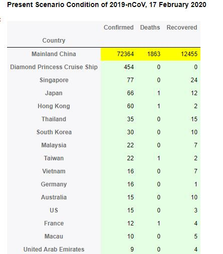

武汉新冠肺炎已经蔓延到全球，根据Kaggle中的数据集，对数据分析及可视化。

数据集：https://www.kaggle.com/sudalairajkumar/novel-corona-virus-2019-dataset

数据统计截止日期：2020-02-17

# 原始数据

Kaggle中的数据是每天数据和最终确认的数据两部分，因此在分析时，需要将两部分做处理。

第一种：只取最终数据，根据截至日期截取。

第二种：需要每天的数据时，取每天数据的最大值。

# 全球数据概览

全球数据如下（只截取了某部分）：

根据总的数据，绘制确诊人数的世界地图，如下：

# 中国数据概览

根据中国数据（包括港澳台地区），绘制确诊人数地图，如下：

随着时间的变化，确诊人数在不断扩散，动图如下：

